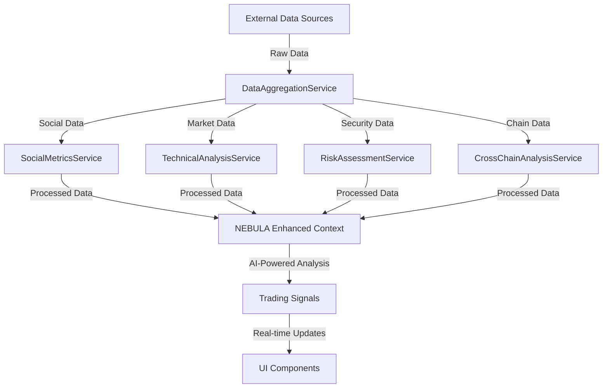
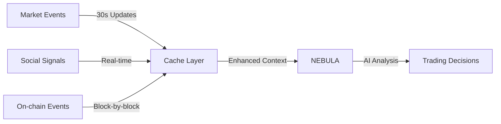
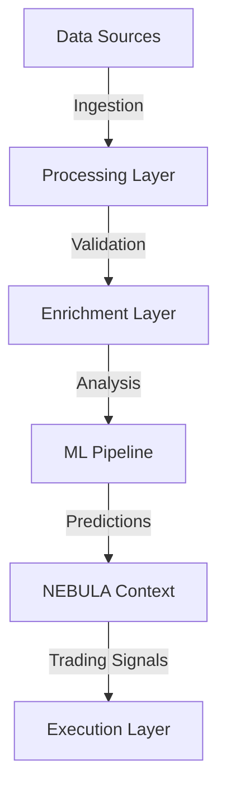
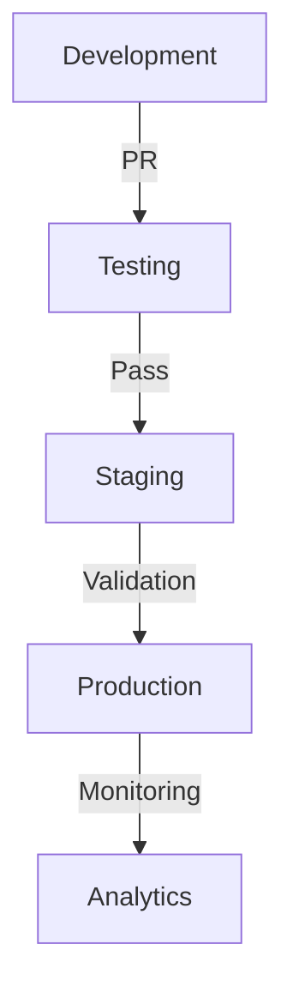

# b/era

A next-generation DeFi and NFT analytics platform that combines institutional-grade market intelligence with AI-powered trading assistance for Berachain and Ethereum.

## Why b/era?

b/era addresses critical gaps in the DeFi and NFT analytics landscape:

1. **Fragmented Data**: Most platforms offer siloed views of either DeFi or NFT data. b/era unifies these insights through our comprehensive DataAggregationService.

2. **Delayed Analysis**: Traditional platforms rely on historical data. b/era provides real-time analysis through WebSocket connections and intelligent caching.

3. **Limited Context**: Existing tools often miss crucial social and cross-chain signals. Our multi-service architecture captures the complete market picture.

4. **Poor Risk Assessment**: Current platforms lack sophisticated risk metrics. b/era's RiskAssessmentService provides institutional-grade risk analysis.

## Architecture Deep Dive

### 1. Core Services Architecture



### 2. Service Integration with NEBULA

#### DataAggregationService
- **Enhanced Context Processing**
```typescript
interface NebulaEnhancedContext {
  marketData: {
    price: number;
    volume24h: number;
    liquidityDepth: number;
    priceImpact: number;
  };
  socialSignals: {
    sentiment: number;
    momentum: number;
    communityGrowth: number;
  };
  riskMetrics: {
    securityScore: number;
    liquidityRisk: number;
    whaleConcentration: number;
  };
  crossChainData: {
    bridgeActivity: number;
    protocolAdoption: number;
    marketShare: number;
  };
}
```

#### Real-time Data Flow


### 3. Advanced Features

#### A. Smart Money Analysis
- **Whale Tracking System**
```typescript
interface WhaleActivity {
  address: string;
  holdings: number;
  recentTrades: {
    timestamp: number;
    action: 'buy' | 'sell';
    amount: number;
    priceImpact: number;
  }[];
  crossChainActivity: {
    chain: string;
    volume24h: number;
  }[];
}
```

#### B. Risk Assessment Engine
- **Multi-factor Risk Scoring**
```typescript
interface RiskScore {
  overall: number;  // 0-100
  factors: {
    smartContractRisk: number;
    liquidityRisk: number;
    concentrationRisk: number;
    marketManipulationRisk: number;
  };
  recommendations: {
    maxPosition: number;
    entryStrategy: string;
    exitStrategy: string;
  };
}
```

### 4. NEBULA Integration Benefits

#### A. Enhanced Decision Making
- Combines NEBULA's blockchain intelligence with:
  - Real-time market data
  - Social sentiment analysis
  - Whale activity tracking
  - Cross-chain metrics

#### B. Predictive Analytics
```typescript
interface PredictiveModel {
  shortTerm: {
    priceTarget: number;
    confidence: number;
    timeframe: '1h' | '4h' | '24h';
  };
  longTerm: {
    trendPrediction: 'bullish' | 'bearish' | 'neutral';
    supportLevels: number[];
    resistanceLevels: number[];
  };
  signals: {
    technical: string[];
    fundamental: string[];
    sentiment: string[];
  };
}
```

### 5. Real-time Processing Pipeline



#### Processing Stages:
1. **Data Ingestion**
   - Multi-source data collection
   - Rate limiting and queueing
   - Data validation

2. **Enrichment**
   - Cross-validation
   - Pattern detection
   - Anomaly identification

3. **Analysis**
   - ML model processing
   - Signal generation
   - Risk assessment

4. **Execution**
   - Strategy formulation
   - Order optimization
   - Risk management

### 6. API Integration Points

#### A. Market Data Endpoints
```typescript
// Price impact analysis
GET /api/v1/analysis/price-impact
{
  tokenAddress: string;
  amount: string;
  side: 'buy' | 'sell';
  timeWindow?: number;
}

// Smart money tracking
GET /api/v1/analysis/smart-money
{
  tokenAddress: string;
  timeWindow: number;
  minimumHolding: string;
}

// Risk assessment
GET /api/v1/analysis/risk-score
{
  tokenAddress: string;
  includeFactors: string[];
}
```

#### B. NEBULA Enhanced Endpoints
```typescript
// Enhanced context
POST /api/v1/nebula/context
{
  message: string;
  enrichWith: {
    marketData: boolean;
    socialSignals: boolean;
    whaleActivity: boolean;
    technicalAnalysis: boolean;
  };
}

// Predictive analytics
POST /api/v1/nebula/predict
{
  tokenAddress: string;
  timeframe: '1h' | '24h' | '7d';
  factors: string[];
}
```

## Architecture

### Core Services

1. **DataAggregationService**
   - **Why**: Central orchestrator for all data collection and analysis
   - **How**: 
     - Manages parallel data fetching from all services
     - Implements smart caching (30s for high-frequency data)
     - Provides real-time updates via WebSocket/polling
     - Handles historical data aggregation

2. **SocialMetricsService**
   - **Why**: Social signals often precede market movements
   - **How**:
     - Twitter sentiment analysis and engagement tracking
     - Discord community growth and activity metrics
     - Telegram group dynamics and trend detection
     - Real-time social feed monitoring

3. **TechnicalAnalysisService**
   - **Why**: Professional-grade market analysis
   - **How**:
     - Volume and liquidity analysis
     - Pattern recognition
     - Price prediction models
     - Momentum indicators
     - Volatility metrics

4. **RiskAssessmentService**
   - **Why**: Institutional-grade risk management
   - **How**:
     - Security audit analysis
     - Liquidity risk assessment
     - Whale movement tracking
     - Market manipulation detection
     - Smart contract risk scoring

5. **CrossChainAnalysisService**
   - **Why**: Comprehensive cross-chain market intelligence
   - **How**:
     - Bridge activity monitoring
     - Protocol comparison metrics
     - Market share analysis
     - Efficiency metrics tracking
     - Adoption curve analysis

## Features

### Top Tokens Grid
- **Real-time Market Data**
  - 30-second price updates with multi-source validation
  - Priority token list with guaranteed inclusion
  - Dynamic volume-based token discovery
  - Rich token metadata:
    - Price and volume metrics
    - Market cap and liquidity data
    - Social links and community info
    - Trust scores and risk metrics
  - Automated filtering system:
    - Excludes stablecoins (USDT, USDC, DAI, etc.)
    - Filters out wrapped tokens
    - Removes low-volume tokens (< $100K/24h)
  
- **Data Aggregation**
  - Primary: GeckoTerminal pools for real-time prices
    - Direct pool price monitoring
    - Volume aggregation across pairs
    - Liquidity depth tracking
    - Price change calculations
  - Secondary: GeckoTerminal token API for enriched data
    - Token-specific metrics
    - Market context data
    - Social and community signals
  - Tertiary: DexScreener API as fallback
    - Pair-based price verification
    - Volume and liquidity cross-validation
  - Cross-validation and anomaly detection
    - Price consistency checks
    - Volume validation
    - Market manipulation detection
  
- **Smart Caching**
  - 30-second cache for high-frequency data
  - Parallel data enrichment for priority tokens
  - Multi-threaded processing pipeline
  - Automatic failover mechanisms
  - Cache invalidation strategies:
    - Time-based expiration
    - Event-driven updates
    - Priority token refresh
    - Market event triggers

### NFT Collection Analysis
- **Market Analytics**
  - Real-time floor price tracking
  - Historical volume analysis
    - Daily volume trends
    - Weekly aggregates
    - Monthly patterns
  - Trading velocity metrics
    - Sales frequency
    - Listing rates
    - Time to sale
  - Market cap calculations
  - Bid-ask spread analysis
  
- **Smart Money Tracking**
  - Whale wallet monitoring
    - Large holder tracking
    - Movement analysis
    - Cross-collection activity
  - Accumulation pattern detection
    - Buy pressure analysis
    - Holder concentration
    - Average position size
  - Wash trading identification
    - Circular trade detection
    - Suspicious pattern flagging
    - Volume authenticity scoring
  - Bidder concentration analysis
  - Portfolio optimization signals
  
- **Risk Assessment**
  - Market manipulation detection
    - Wash trading alerts
    - Price manipulation signals
    - Abnormal activity flags
  - Liquidity depth analysis
    - Bid/ask book depth
    - Market impact estimation
    - Slippage projections
  - Volume sustainability scoring
  - Price movement validation
  - Holder concentration metrics

### AI-Powered Trading Assistant
- **Market Intelligence**
  - Pattern recognition in trading data
  - Anomaly detection for market events
  - Predictive analytics for trends
  - Risk scoring for tokens/pools
  - Cross-market correlation analysis
  - Machine learning models:
    - Price prediction
    - Volume forecasting
    - Risk assessment
    - Market sentiment analysis

- **Portfolio Management**
  - Position sizing recommendations
  - Risk-adjusted entry/exit points
  - Portfolio rebalancing signals
  - Gas optimization strategies
  - PnL tracking and analysis
  - Advanced analytics:
    - Risk-adjusted returns
    - Portfolio correlation
    - Diversification metrics
    - Performance attribution

## Technical Integration

### Data Sources

#### 1. GeckoTerminal Integration
- **Pool Data**
  - Real-time price discovery
    - WebSocket price feeds
    - Order book updates
    - Trade execution data
  - Volume aggregation
    - Cross-pool aggregation
    - Volume verification
    - Wash trade filtering
  - Liquidity depth tracking
  - Price change calculations
  
- **Token Discovery**
  - Priority token tracking
    - Guaranteed monitoring
    - Enhanced update frequency
    - Deep data collection
  - Volume-based discovery
    - Dynamic threshold adjustment
    - Trending token detection
  - Smart filtering logic
    - Multi-factor filtering
    - Adaptive thresholds
    - Quality scoring
  - Metadata enrichment
    - Social metrics
    - Community data
    - Development activity

#### 2. Cielo API Integration
- **Token Analysis**
  - Full activity labeling
    - Transaction classification
    - Intent detection
    - Pattern recognition
  - PnL tracking
    - Position-level analysis
    - Realized/unrealized split
    - Tax lot tracking
  - Portfolio management
    - Holdings analysis
    - Risk metrics
    - Performance attribution
  - Risk assessment
    - Market risk scoring
    - Liquidity risk analysis
    - Counterparty risk evaluation

- **NFT Analysis**
  - Collection discovery
    - Trending detection
    - Volume analysis
    - Social signals
  - Floor price tracking
    - Real-time monitoring
    - Historical analysis
    - Predictive modeling
  - Volume analysis
    - Authentic volume verification
    - Wash trade filtering
    - Buyer/seller analysis
  - Market sentiment
    - Social media analysis
    - Community metrics
    - Developer activity
  - Trading patterns
    - Whale tracking
    - Smart money following
    - Manipulation detection

#### 3. OogaBooga Integration

##### Live DEX Integrations
- **AMM DEXs**
  - Kodiak V2 (Constant Product AMM)
  - Kodiak V3 (Concentrated Liquidity)
  - Bex (Constant Product AMM)
  - Honeypot (Constant Product AMM)
  - Grizzly (Concentrated Liquidity + Hooks)
  - Izumi (Concentrated Liquidity + Limit Orders)
  - Marginal (Perpetuals + CP AMM)
  - Memeswap (Launchpad + CP AMM)
  - Bulla (Concentrated Liquidity + Hooks)

- **Specialized DEXs**
  - Burr Bear
    - Multi Stable Pools (StableSwap AMM)
    - Generalized Pools (CP + Multi-Token AMM)
    - Burr Pools (Bonding Curve AMM)
  - Twin Finance (CP AMM)
  - WeBera (Yield Protocol)

- **Other Protocols**
  - Beradrome (Restaking Protocol)
  - Honeyswap (Stablecoin Wrapper)
  - Berps (Perpetuals Protocol)
  - Bend (Lending Protocol)
  - WBERA (Native Wrapper)

#### 4. Nebula Integration
- **Blockchain AI Engine**
  - Real-time onchain data analysis
    - Cross-chain data monitoring
    - Smart contract interaction
    - Transaction pattern recognition
  - Natural language processing
    - Trading instruction interpretation
    - Market analysis queries
    - Portfolio recommendations
  - Autonomous trading capabilities
    - Market condition monitoring
    - Trade execution optimization
    - Risk management automation

- **Advanced Analytics**
  - Smart contract analysis
    - Code quality assessment
    - Vulnerability detection
    - Gas optimization suggestions
  - Portfolio intelligence
    - Position optimization
    - Risk exposure analysis
    - Performance forecasting
  - Market sentiment analysis
    - Social signal processing
    - Community engagement metrics
    - Developer activity tracking

- **API Integration**
```typescript
POST https://nebula-api.thirdweb.com/chat
```
Request format:
```typescript
interface NebulaRequest {
  message: string;
  stream: boolean;
  options?: {
    temperature?: number;
    maxTokens?: number;
  }
}
```

### API Endpoints

#### 1. Price API
```typescript
GET https://mainnet.api.oogabooga.io/v1/prices?currency=USD
```
Response format:
```typescript
interface PriceResponse {
  prices: {
    [tokenAddress: string]: {
      price: string;
      timestamp: number;
      confidence: number;
    }
  };
  metadata: {
    lastUpdate: number;
    nextUpdate: number;
  }
}
```

#### 2. Swap API
```typescript
POST https://mainnet.api.oogabooga.io/v1/swap/${chainId}
```
Request format:
```typescript
interface SwapRequest {
  tokenIn: string;
  tokenOut: string;
  amount: string;
  slippageBps: number;
  recipient: string;
}
```

#### 3. Token Approval API
```typescript
GET https://mainnet.api.oogabooga.io/v1/approve/allowance
POST https://mainnet.api.oogabooga.io/v1/approve
```
- Allowance checking
- Approval transaction generation
- Infinite approval support
- Revocation support

### Network Support

| Network | Chain ID | API Base URL |
|---------|----------|--------------|
| Berachain | 80094 | https://mainnet.api.oogabooga.io |
| Berachain bArtio | 80084 | https://bartio.api.oogabooga.io |

### Smart Contract Integration
- OBRouter for swap execution
- Dynamic executor contracts
- Wagmi v2 integration
- Viem utilities

### Reservoir API Integration
- Collection analytics
- Trading metrics
- Market intelligence
- Portfolio tracking
- Risk assessment

## Setup and Configuration

### Prerequisites

- Node.js 18+
- pnpm 8+
- Redis (for caching)
- MongoDB (for historical data)

### Installation

1. **Clone the Repository**
```bash
git clone https://github.com/yourusername/b-era.git
cd b-era
```

2. **Install Dependencies**
```bash
pnpm install
```

3. **Configure Environment**
```bash
# .env.local

# Core API Keys
NEXT_PUBLIC_OOGABOOGA_API_KEY=your_oogabooga_api_key
NEXT_PUBLIC_RESERVOIR_API_KEY=your_reservoir_api_key_here
CIELO_API_KEY=your_cielo_api_key_here
THIRDWEB_SECRET_KEY=your_nebula_api_key_here

# Social Media APIs
NEXT_PUBLIC_TWITTER_API_KEY=your_twitter_api_key
NEXT_PUBLIC_DISCORD_BOT_TOKEN=your_discord_bot_token
NEXT_PUBLIC_TELEGRAM_API_KEY=your_telegram_api_key

# Market Data APIs
NEXT_PUBLIC_GECKOTERMINAL_API_KEY=your_geckoterminal_key
NEXT_PUBLIC_DEXSCREENER_API_KEY=your_dexscreener_key

# Machine Learning Configuration
NEXT_PUBLIC_ENABLE_ML_PIPELINE=true
NEXT_PUBLIC_ML_MODEL_ENDPOINT=your_model_endpoint

# Infrastructure
NEXT_PUBLIC_REDIS_URL=redis://localhost:6379
NEXT_PUBLIC_MONGODB_URI=mongodb://localhost:27017/bera
```

4. **Start Required Services**
```bash
# Start Redis
redis-server

# Start MongoDB
mongod
```

5. **Run Development Server**
```bash
pnpm dev
```

### Service Configuration

1. **DataAggregationService**
   - Configure cache TTL in `src/config/cache.ts`
   - Adjust polling intervals in `src/config/polling.ts`
   - Set up WebSocket connections in `src/config/websocket.ts`

2. **SocialMetricsService**
   - Configure API rate limits in `src/config/rateLimit.ts`
   - Set up sentiment analysis models in `src/config/ml.ts`
   - Define social metrics thresholds in `src/config/metrics.ts`

3. **TechnicalAnalysisService**
   - Configure technical indicators in `src/config/indicators.ts`
   - Set up price prediction models in `src/config/prediction.ts`
   - Define market patterns in `src/config/patterns.ts`

4. **RiskAssessmentService**
   - Configure risk thresholds in `src/config/risk.ts`
   - Set up security scanning in `src/config/security.ts`
   - Define whale tracking parameters in `src/config/whales.ts`

5. **CrossChainAnalysisService**
   - Configure supported chains in `src/config/chains.ts`
   - Set up bridge monitoring in `src/config/bridges.ts`
   - Define cross-chain metrics in `src/config/crosschain.ts`

### API Keys

- **OogaBooga API**: Contact @beranoulli or @whoiskevinn on Telegram
- **Cielo API**: Visit https://cielo.finance
- **Reservoir API**: Visit https://reservoir.tools
- **Thirdweb API**: Visit https://thirdweb.com/dashboard

### Development Guidelines

1. **Code Style**
   - Follow TypeScript best practices
   - Use ES6+ features
   - Implement proper error handling
   - Write comprehensive tests

2. **Performance**
   - Optimize database queries
   - Implement proper caching
   - Use WebSocket where appropriate
   - Minimize API calls

3. **Security**
   - Never commit API keys
   - Implement rate limiting
   - Validate all inputs
   - Follow security best practices

## Disclaimer

This application is a conceptual prototype and not a fully operational product. The application is for educational purposes only and should not be considered financial advice.

### 7. Implementation Details

#### A. NEBULA Integration Setup
```typescript
// src/lib/nebula/config.ts
interface NebulaConfig {
  apiKey: string;
  baseUrl: string;
  options: {
    maxRetries: number;
    timeout: number;
    rateLimitRPS: number;
  };
  enrichment: {
    enableMarketData: boolean;
    enableSocialSignals: boolean;
    enableWhaleTracking: boolean;
    enableTechnicalAnalysis: boolean;
  };
  ml: {
    modelEndpoint: string;
    batchSize: number;
    updateInterval: number;
  };
}
```

#### B. Service Integration
```typescript
// src/lib/nebula/integration.ts
class NebulaIntegration {
  constructor(
    private config: NebulaConfig,
    private dataAggregator: DataAggregationService,
    private riskAssessment: RiskAssessmentService
  ) {}

  async enhanceContext(message: string): Promise<NebulaEnhancedContext> {
    // Fetch and combine data from all services
    const [marketData, socialSignals, riskMetrics, crossChainData] = 
      await Promise.all([
        this.dataAggregator.getMarketData(),
        this.dataAggregator.getSocialMetrics(),
        this.riskAssessment.evaluate(),
        this.dataAggregator.getCrossChainMetrics()
      ]);

    return {
      marketData,
      socialSignals,
      riskMetrics,
      crossChainData
    };
  }

  async generateTradingSignals(
    context: NebulaEnhancedContext
  ): Promise<TradingSignals> {
    // Process enhanced context through NEBULA
    const response = await this.queryNebula({
      context,
      task: 'generate_trading_signals'
    });

    return this.processTradingSignals(response);
  }
}
```

#### C. ML Pipeline Integration
```typescript
// src/lib/ml/pipeline.ts
interface MLPipeline {
  modelConfig: {
    architecture: string;
    inputFeatures: string[];
    outputLabels: string[];
  };
  training: {
    batchSize: number;
    epochs: number;
    validationSplit: number;
  };
  inference: {
    threshold: number;
    confidenceRequired: number;
  };
}
```

### 8. Configuration Management

#### A. Environment Variables
```bash
# .env.local

# NEBULA Configuration
NEBULA_API_KEY=your_nebula_api_key
NEBULA_MODEL_ENDPOINT=your_model_endpoint
NEBULA_MAX_RETRIES=3
NEBULA_TIMEOUT_MS=5000
NEBULA_RATE_LIMIT_RPS=10

# ML Pipeline Configuration
ML_MODEL_ARCHITECTURE=transformer
ML_BATCH_SIZE=32
ML_UPDATE_INTERVAL=300
ML_CONFIDENCE_THRESHOLD=0.85

# Service Integration
ENABLE_MARKET_DATA=true
ENABLE_SOCIAL_SIGNALS=true
ENABLE_WHALE_TRACKING=true
ENABLE_TECHNICAL_ANALYSIS=true
```

#### B. Service Configuration
```typescript
// src/config/services.ts
interface ServiceConfig {
  nebula: NebulaConfig;
  dataAggregation: {
    cacheTimeout: number;
    updateInterval: number;
    maxConcurrentRequests: number;
  };
  riskAssessment: {
    riskThresholds: {
      low: number;
      medium: number;
      high: number;
    };
    updateFrequency: number;
  };
  mlPipeline: MLPipeline;
}
```

### 9. Development Workflow

#### A. Local Development
1. **Setup Environment**
```bash
# Install dependencies
pnpm install

# Configure environment variables
cp .env.example .env.local

# Start development services
pnpm dev
```

2. **Testing NEBULA Integration**
```bash
# Run integration tests
pnpm test:nebula

# Test ML pipeline
pnpm test:ml

# Run end-to-end tests
pnpm test:e2e
```

#### B. Deployment Pipeline


### 10. Monitoring and Analytics

#### A. Service Health Metrics
```typescript
interface ServiceHealth {
  nebula: {
    responseTime: number;
    successRate: number;
    errorRate: number;
  };
  mlPipeline: {
    accuracy: number;
    latency: number;
    throughput: number;
  };
  dataAggregation: {
    updateFrequency: number;
    cacheHitRate: number;
    errorRate: number;
  };
}
```

#### B. Performance Monitoring
- Real-time metrics dashboard
- Error tracking and alerting
- Performance optimization suggestions
- Resource utilization monitoring

### 11. Suggested Improvements

#### A. Caching Layer Enhancement
```typescript
// Implement intelligent caching with TTL and size management
interface CacheConfig {
  ttl: number;          // Time to live in seconds
  maxSize: number;      // Maximum cache size
  strategy: 'LRU' | 'LFU'; // Cache eviction strategy
}

// Benefits:
// - Reduced API calls
// - Improved response times
// - Better resource utilization
// - Configurable cache policies
```

#### B. Advanced Rate Limiting
```typescript
// Implement sophisticated rate limiting per service
interface RateLimitConfig {
  maxRequests: number;  // Maximum requests allowed
  windowMs: number;     // Time window in milliseconds
  strategy: 'sliding' | 'fixed'; // Window type
}

// Benefits:
// - Prevents API abuse
// - Service protection
// - Configurable per endpoint
// - Sliding window support
```

#### C. Enhanced Error Handling
```typescript
// Implement comprehensive error tracking and notification
enum ErrorSeverity {
  LOW = 'low',
  MEDIUM = 'medium',
  HIGH = 'high',
  CRITICAL = 'critical'
}

interface ErrorContext {
  service: string;
  method: string;
  params?: Record<string, any>;
  timestamp: Date;
}

// Benefits:
// - Better error tracking
// - Severity-based handling
// - Admin notifications
// - Error context preservation
```

#### D. Service Metrics Collection
```typescript
// Implement detailed service performance tracking
interface ServiceMetrics {
  requestCount: number;
  errorCount: number;
  averageResponseTime: number;
  lastUpdated: Date;
}

// Benefits:
// - Performance monitoring
// - Service health tracking
// - Response time analysis
// - Error rate monitoring
```

#### E. Dependency Management
```typescript
// Implement centralized service registry
class ServiceRegistry {
  register(name: string, service: any, dependencies: string[]): void;
  get<T>(name: string): T;
  validateDependencies(): void;
}

// Benefits:
// - Centralized dependency management
// - Automatic dependency validation
// - Service lifecycle management
// - Better maintainability
```

#### Implementation Strategy

1. **Phase 1: Core Infrastructure**
   - Implement CacheService
   - Add RateLimiter
   - Set up ErrorHandler
   - Deploy MetricsCollector

2. **Phase 2: Service Enhancement**
   - Integrate caching in all services
   - Implement rate limiting for APIs
   - Add comprehensive error handling
   - Set up metrics collection

3. **Phase 3: Optimization**
   - Fine-tune cache settings
   - Optimize rate limits
   - Enhance error reporting
   - Improve metrics visualization

4. **Phase 4: Monitoring**
   - Set up monitoring dashboards
   - Configure alerts
   - Implement performance tracking
   - Deploy health checks

#### Configuration Updates

Add the following to your `.env.local`:

```bash
# Cache Configuration
CACHE_TTL=300
CACHE_MAX_SIZE=1000
CACHE_STRATEGY=LRU

# Rate Limiting
RATE_LIMIT_MAX_REQUESTS=100
RATE_LIMIT_WINDOW_MS=60000
RATE_LIMIT_STRATEGY=sliding

# Error Handling
ERROR_NOTIFICATION_ENDPOINT=your_notification_endpoint
ERROR_NOTIFICATION_THRESHOLD=high

# Metrics Collection
METRICS_COLLECTION_INTERVAL=60000
METRICS_RETENTION_DAYS=30
```

#### Integration Example

```typescript
// Example service integration with improvements
class EnhancedService {
  constructor(
    private cache: CacheService,
    private rateLimiter: RateLimiter,
    private errorHandler: ErrorHandler,
    private metrics: MetricsCollector
  ) {}

  async getData(key: string): Promise<Data> {
    const start = Date.now();
    
    try {
      // Check cache
      const cached = await this.cache.get(key);
      if (cached) return cached;

      // Check rate limit
      if (!await this.rateLimiter.checkLimit()) {
        throw new Error('Rate limit exceeded');
      }

      // Fetch data
      const data = await this.fetchData(key);
      
      // Update cache
      await this.cache.set(key, data);
      
      // Track metrics
      this.metrics.trackRequest('getData', Date.now() - start, true);
      
      return data;
    } catch (error) {
      // Handle error
      await this.errorHandler.handleError(error, {
        service: 'EnhancedService',
        method: 'getData',
        params: { key }
      });
      
      // Track error metrics
      this.metrics.trackRequest('getData', Date.now() - start, false);
      
      throw error;
    }
  }
}
```

These improvements will enhance the platform's:
- Performance through intelligent caching
- Reliability with rate limiting
- Observability with better error handling
- Maintainability with service metrics
- Scalability with proper dependency management

Each enhancement is designed to be modular and configurable, allowing for easy integration with existing services while providing immediate benefits to the platform's overall functionality and reliability.
